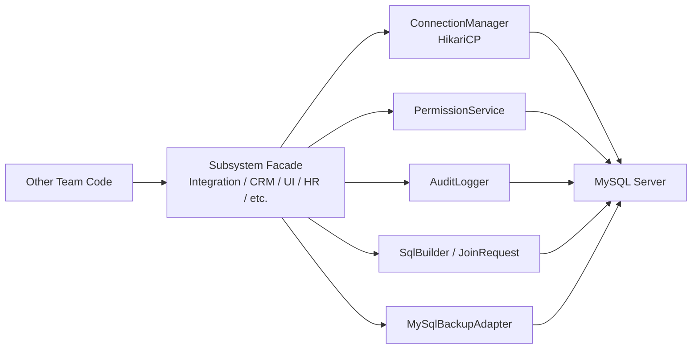

# Architecture And Design

## High-Level View

## Layers

### 1. Facade Layer

Classes in `com.erp.sdk.subsystem` are the subsystem-facing entry points. This satisfies the requirement that each subsystem gets its own interface class named after the subsystem.

### 2. Security Layer

`PermissionService` loads rules from `permission_matrix` and throws unauthorized access exceptions whenever a subsystem attempts to access a table not granted to it.

### 3. DB Access Layer

`ConnectionManager` uses HikariCP to keep a pool of JDBC connections open for concurrent access.

### 4. Logging Layer

`AuditLogger` writes success/failure events into `audit_logs`.

### 5. Backup Layer

`MySqlBackupAdapter` wraps `mysqldump` and `mysql` CLI usage and is exposed only through admin-checked methods.

### 6. SQL Layer

`SqlBuilder` centralizes internal SQL generation so subsystems do not directly compose and execute arbitrary SQL.

## Design Patterns

### Creational Pattern

- `SubsystemFactory`
  Creates the correct subsystem facade object.

### Structural Patterns

- Facade
  Each subsystem class acts as a controlled access facade.
- Adapter
  `MySqlBackupAdapter` adapts external MySQL backup/restore commands to the subsystem API.

### Behavioral Pattern

- Template Method style flow in `AbstractSubsystem.execute(...)`
  Common flow for connection acquisition, operation execution, rollback, logging, and commit.

## SOLID And GRASP

- SRP: connection, security, logging, backup, and subsystem access are separated
- OCP: new subsystem support can be added by extending the facade set and factory mapping
- DIP: callers use subsystem APIs rather than raw JDBC
- Controller: subsystem facades coordinate requests
- Information Expert: permission logic lives in `PermissionService`, connection logic in `ConnectionManager`, and audit logic in `AuditLogger`
