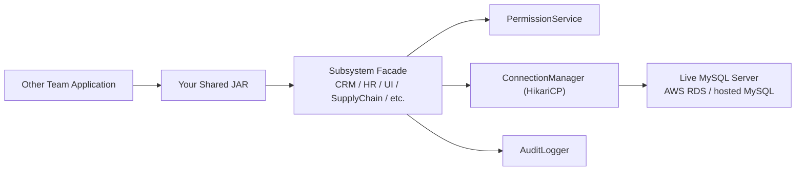

# How Other Subsystems Use The Deployed Database

## Short Answer

Other subsystems should **not** connect to the deployed MySQL database and run SQL directly.

They should use:

1. the deployed live MySQL server as the backend data store
2. your shared Java JAR as the only approved access layer
3. their subsystem facade class such as `CRM`, `SupplyChain`, `UI`, `HR`, or `Business Intelligence`

This is exactly what your requirement says:

- the DB server is separate and live
- subsystems cannot directly access the DB and execute queries
- your Java class/JAR must be shared with other teams

## Recommended Deployment Model



## What You Deploy

You deploy:

- the MySQL schema from `sql/01-schema.sql`
- the Java JAR from `target/erp-subsystem-sdk-1.0.0.jar`
- one shared config file that points to the live database host

The live database can be:

- Amazon RDS MySQL
- a college lab VM with MySQL
- any hosted MySQL 8+ server

## What Other Teams Need From You

Give them:

1. `erp-subsystem-sdk-1.0.0.jar`
2. the package/class usage instructions
3. the hostname, port, database name, username, and password for the deployed DB
4. the subsystem name they must instantiate
5. the list of tables/methods they are allowed to use through the facade

## How They Should Integrate

### Step 1. Add your JAR

They add your built JAR to their Java project classpath.

### Step 2. Use the live DB config

They create a properties file like:

```properties
db.host=<your-live-host>
db.port=3306
db.name=erp_subsystem
db.username=<shared-app-user>
db.password=<shared-app-password>
db.pool.maxSize=10
db.backup.dir=backups
db.dump.command=mysqldump
db.restore.command=mysql
```

### Step 3. Create their subsystem facade

Example for CRM:

```java
DatabaseConfig config = DatabaseConfig.fromProperties(Path.of("application.properties"));
CRM crm = (CRM) SubsystemFactory.create(SubsystemName.CRM, config);
```

Example for Business Intelligence:

```java
DatabaseConfig config = DatabaseConfig.fromProperties(Path.of("application.properties"));
BusinessIntelligence bi = (BusinessIntelligence) SubsystemFactory.create(SubsystemName.BUSINESS_INTELLIGENCE, config);
```

### Step 4. Use facade methods only

They should call methods like:

- `create(...)`
- `readAll(...)`
- `readById(...)`
- `update(...)`
- `delete(...)`
- `join(...)`

They should not write:

- raw JDBC code
- direct `SELECT/INSERT/UPDATE/DELETE`
- direct DB login logic bypassing your subsystem layer

## Why This Matters

Using your JAR instead of direct DB access guarantees:

- access control is enforced
- unauthorized tables raise exceptions
- audit logs are recorded
- joins are centrally handled
- connection pooling is reused
- all teams use one canonical schema and compatibility layer

## How To Set Up The Live Database

### Option A. Amazon RDS

1. Create a MySQL RDS instance
2. Create the database `erp_subsystem`
3. Open inbound access only for allowed IPs
4. Load `sql/01-schema.sql`
5. Create an application user
6. Share that endpoint/config with teams

### Option B. Existing Hosted MySQL

1. Create database `erp_subsystem`
2. Load `sql/01-schema.sql`
3. Create a restricted application user
4. Share endpoint/config with teams

## Best Practice For Credentials

Do not give every team `root`.

Instead:

1. Create one app user for normal subsystem access
2. Keep admin credentials only with your database integration team
3. Reserve backup/restore for admin accounts

## Recommended Demo Explanation

You can say:

"The database is deployed on a live MySQL server, but other subsystems do not access it directly. They compile our JAR with their code, instantiate their subsystem facade, and all CRUD, joins, permissions, logging, and connection pooling are handled inside our integration layer."

## If Faculty Asks "Why Not Direct DB Access?"

Answer:

- It violates the requirement
- It bypasses permission checks
- It bypasses audit logging
- It causes inconsistent joins and schema usage
- It defeats the purpose of the integration subsystem
